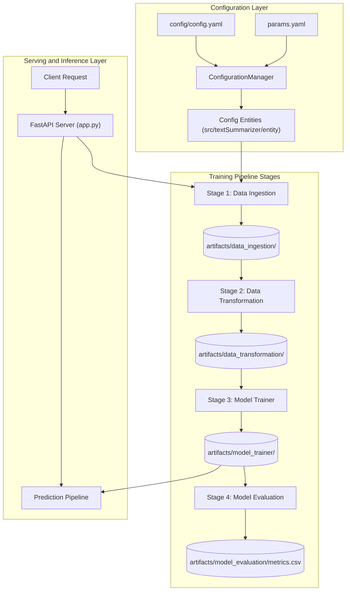

# Text Summarization Pipeline Using Hugging Face Pegasus

An end-to-end, modular Natural Language Processing (NLP) pipeline for abstractive dialogue summarization using Google Pegasus (`google/pegasus-cnn_dailymail`) fine-tuned on the SAMSum dataset. The project implements a production-grade machine learning lifecycle comprising configuration management, staged pipeline components, artifact tracking, automated evaluation with ROUGE metrics, and a FastAPI deployment server.

---

## Table of Contents

- [Project Overview](#project-overview)
- [Key Features](#key-features)
- [Architecture and Workflow](#architecture-and-workflow)
- [Repository Structure](#repository-structure)
- [Pipeline Components](#pipeline-components)
  - [1. Data Ingestion](#1-data-ingestion)
  - [2. Data Transformation](#2-data-transformation)
  - [3. Model Training](#3-model-training)
  - [4. Model Evaluation](#4-model-evaluation)
  - [5. Prediction Pipeline](#5-prediction-pipeline)
- [Configuration and Hyperparameters](#configuration-and-hyperparameters)
- [Installation and Setup](#installation-and-setup)
- [Running the Application](#running-the-application)
  - [1. End-to-End Pipeline Execution](#1-end-to-end-pipeline-execution)
  - [2. FastAPI Web Service](#2-fastapi-web-service)
  - [3. Docker Deployment](#3-docker-deployment)
- [API Documentation and Usage](#api-documentation-and-usage)
- [Evaluation Metrics](#evaluation-metrics)
- [Logging and Utilities](#logging-and-utilities)
- [License](#license)

---

## Project Overview

Summarizing human dialogues and conversations is challenging due to informal language, turn-taking, and varying dialogue lengths. This project provides a robust, reproducible, and configurable solution to fine-tune sequence-to-sequence transformer architectures for text summarization tasks.

The solution utilizes:
- **Base Architecture**: Hugging Face Transformers (`google/pegasus-cnn_dailymail`)
- **Dataset**: SAMSum dialogue dataset (conversations with corresponding human-written summaries)
- **Design Pattern**: Modular configuration-driven component design (`config.yaml` -> `params.yaml` -> `entity` -> `configuration manager` -> `component` -> `pipeline`)
- **Serving Layer**: FastAPI application exposing endpoints for pipeline triggering and real-time text summarization

---

## Key Features

- **Modular MLOps Design**: Clean separation of concerns across data ingestion, preprocessing, training, evaluation, and serving.
- **Config-Driven Architecture**: Hyperparameters, dataset URLs, artifact paths, and model configurations are completely decoupled from source code.
- **Abstractive Summarization**: Utilizes Pegasus with beam search decoding (`num_beams=8`, `length_penalty=0.8`) to generate concise, fluent summaries.
- **Comprehensive Evaluation**: Computes ROUGE metrics (`ROUGE-1`, `ROUGE-2`, `ROUGE-L`, `ROUGE-Lsum`) and exports benchmark results to CSV.
- **Production-Ready API**: FastAPI backend with Swagger UI documentation (`/docs`) for seamless integration.
- **Centralized Logging and Validation**: Custom logging handler routing to standard output and log files, backed by `ensure_annotations` and `ConfigBox` data validation.

---

## Architecture and Workflow

The system follows a standard MLOps component workflow:



### Component Execution Lifecycle
Every stage follows a standardized 6-step implementation workflow:
1. Update `config.yaml` with stage-specific directories and paths.
2. Update `params.yaml` with stage-specific model hyperparameters.
3. Define data contracts in `src/textSummarizer/entity`.
4. Add configuration loaders to `ConfigurationManager` in `src/textSummarizer/config/configuration.py`.
5. Implement business logic inside `src/textSummarizer/components/`.
6. Integrate and trigger the stage from `src/textSummarizer/pipeline/` and orchestrate via `main.py`.

---

## Repository Structure

```
textsummerizer_main/
|-- .github/workflows/                 # CI/CD workflow configuration
|-- config/
|   `-- config.yaml                    # Global paths and artifact locations
|-- research/                          # Jupyter notebooks for experimentation
|   |-- 1_data_ingestion.ipynb
|   |-- 2_data_transformation.ipynb
|   |-- 3_model_trainer.ipynb
|   |-- 4_model_evaluation.ipynb
|   |-- research.ipynb
|   `-- textsummarizer.ipynb
|-- src/
|   `-- textSummarizer/                # Main package source
|       |-- __init__.py
|       |-- components/                # Pipeline stages implementation
|       |   |-- __init__.py
|       |   |-- data_ingestion.py
|       |   |-- data_transformation.py
|       |   |-- model_evaluation.py
|       |   `-- model_trainer.py
|       |-- config/                    # Configuration manager
|       |   |-- __init__.py
|       |   `-- configuration.py
|       |-- constants/                 # Constant definitions (paths, flags)
|       |   `-- __init__.py
|       |-- entity/                    # Data class definitions and configs
|       |   `-- __init__.py
|       |-- logging/                   # Logging setup and log file handler
|       |   `-- __init__.py
|       |-- pipeline/                  # Pipeline runners
|       |   |-- __init__.py
|       |   |-- predicition_pipeline.py
|       |   |-- stage_1_data_ingestion_pipeline.py
|       |   |-- stage_2_data_transformation_pipeline.py
|       |   |-- stage_3_model_trainer_pipeline.py
|       |   `-- stage_4_model_evaluation.py
|       `-- utils/                     # Helper functions (yaml reading, dir creation)
|           |-- __init__.py
|           `-- common.py
|-- app.py                             # FastAPI application entry point
|-- Dockerfile                         # Containerization script
|-- main.py                            # Pipeline training orchestrator
|-- params.yaml                        # Model training hyperparameters
|-- requirements.txt                   # Project dependencies
|-- setup.py                           # Package installation script
|-- template.py                        # Project structure scaffolding script
`-- README.md                          # Project documentation
```

---

## Pipeline Components

### 1. Data Ingestion
- **File**: `src/textSummarizer/components/data_ingestion.py`
- **Functionality**: Downloads the zipped SAMSum dataset archive from the configured remote URL and extracts its contents into `artifacts/data_ingestion/`.
- **Output**: Dataset splits (`train`, `test`, `validation`) stored locally on disk.

### 2. Data Transformation
- **File**: `src/textSummarizer/components/data_transformation.py`
- **Functionality**: Loads the raw dataset splits and tokenizes input dialogues and target summaries using `AutoTokenizer` from Hugging Face (`google/pegasus-cnn_dailymail`).
- **Processing**:
  - Maximum input dialogue sequence length: `1024` tokens
  - Maximum target summary sequence length: `128` tokens
- **Output**: Tokenized PyTorch-ready dataset persisted to `artifacts/data_transformation/samsum_dataset`.

### 3. Model Training
- **File**: `src/textSummarizer/components/model_trainer.py`
- **Functionality**: Loads preprocessed datasets and the pretrained `google/pegasus-cnn_dailymail` checkpoint. Fine-tunes the model using `Seq2SeqTrainer` and `DataCollatorForSeq2Seq`.
- **Hardware Acceleration**: Automatically selects CUDA if an NVIDIA GPU is present, otherwise falls back to CPU.
- **Output**: Trained model weights and tokenizer saved under `artifacts/model_trainer/pegasus-samsum-model` and `artifacts/model_trainer/tokenizer`.

### 4. Model Evaluation
- **File**: `src/textSummarizer/components/model_evaluation.py`
- **Functionality**: Evaluates model summaries against reference target summaries on the test split. Generates predictions using batch processing with beam search (`num_beams=8`, `length_penalty=0.8`).
- **Metrics**: Computes standard summarization evaluation scores: `ROUGE-1`, `ROUGE-2`, `ROUGE-L`, and `ROUGE-Lsum`.
- **Output**: Summary evaluation table exported to `artifacts/model_evaluation/metrics.csv`.

### 5. Prediction Pipeline
- **File**: `src/textSummarizer/pipeline/predicition_pipeline.py`
- **Functionality**: Exposes a clean Python inference class `PredictionPipeline` utilizing Hugging Face's `pipeline("summarization")` abstraction for generating abstractive summaries from raw text.

---

## Configuration and Hyperparameters

The project uses two YAML files to manage environments, parameters, and paths:

### 1. `config/config.yaml`
```yaml
artifacts_root: artifacts

data_ingestion:
  root_dir: artifacts/data_ingestion
  source_URL: https://github.com/krishnaik06/datasets/raw/refs/heads/main/summarizer-data.zip
  local_data_file: artifacts/data_ingestion/data.zip
  unzip_dir: artifacts/data_ingestion

data_transformation:
  root_dir: artifacts/data_transformation
  data_path: artifacts/data_ingestion/samsum_dataset
  tokenizer_name: google/pegasus-cnn_dailymail

model_trainer:
  root_dir: artifacts/model_trainer
  data_path: artifacts/data_transformation/samsum_dataset
  model_ckpt: google/pegasus-cnn_dailymail

model_evaluation:
  root_dir: artifacts/model_evaluation
  data_path: artifacts/data_transformation/samsum_dataset
  model_path: artifacts/model_trainer/pegasus-samsum-model
  tokenizer_path: artifacts/model_trainer/tokenizer
  metric_file_name: artifacts/model_evaluation/metrics.csv
```

### 2. `params.yaml`
```yaml
TrainingArguments:
  num_train_epochs: 1
  warmup_steps: 500
  per_device_train_batch_size: 1
  weight_decay: 0.01
  logging_steps: 10
  evaluation_strategy: steps
  eval_steps: 500
  save_steps: 1e6
  gradient_accumulation_steps: 16
```

---

## Installation and Setup

### Prerequisites
- Python 3.8, 3.9, or 3.10
- Git
- NVIDIA GPU with CUDA support (recommended for model training)

### Step 1: Clone Repository
```bash
git clone <repository_url>
cd textsummerizer_main
```

### Step 2: Create and Activate Virtual Environment
On Linux / macOS:
```bash
python3 -m venv venv
source venv/bin/activate
```

On Windows (Command Prompt / PowerShell):
```cmd
python -m venv venv
venv\Scripts\activate
```

### Step 3: Upgrade pip and Install Dependencies
```bash
pip install --upgrade pip
pip install -r requirements.txt
```

---

## Running the Application

### 1. End-to-End Pipeline Execution
To execute all stages sequentially (Data Ingestion -> Data Transformation -> Model Training -> Model Evaluation):

```bash
python main.py
```

Execution stages and metrics will be logged to the console and to `logs/continuos_logs.log`.

### 2. FastAPI Web Service
To launch the REST API server locally:

```bash
python app.py
```
Or via Uvicorn CLI directly:
```bash
uvicorn app:app --host 0.0.0.0 --port 8080 --reload
```

Once running, access the interactive Swagger UI at:
```
http://localhost:8080/docs
```

### 3. Docker Deployment

#### Build Docker Image
```bash
docker build -t text-summarizer:latest .
```

#### Run Docker Container
```bash
docker run -d -p 8080:8080 --name text-summarizer-app text-summarizer:latest
```

The application will be accessible at `http://localhost:8080`.

---

## API Documentation and Usage

### Available Endpoints

| HTTP Method | Route | Description | Parameters |
| :--- | :--- | :--- | :--- |
| `GET` | `/` | Redirects to interactive API documentation (`/docs`) | None |
| `GET` | `/train` | Triggers the complete end-to-end training pipeline | None |
| `POST` | `/predict` | Generates an abstractive summary from input text | `text` (Query parameter / string) |

### API Request Examples

#### 1. Summarization Prediction (`POST /predict`)

**cURL Example**:
```bash
curl -X POST "http://localhost:8080/predict?text=Hannah%3A%20Hey%2C%20do%20you%20have%20Betty%27s%20number%3F%0AAmanda%3A%20Yes%2C%20it%27s%20%2B48%20729%20011%20223.%0AHannah%3A%20Thanks%21"
```

**Python Example**:
```python
import requests

url = "http://localhost:8080/predict"
dialogue = """
Hannah: Hey, do you have Betty's number?
Amanda: Yes, it's +48 729 011 223.
Hannah: Thanks!
"""

params = {"text": dialogue}
response = requests.post(url, params=params)

print("Summary:", response.text)
```

#### 2. Pipeline Retraining (`GET /train`)

**cURL Example**:
```bash
curl -X GET "http://localhost:8080/train"
```

---

## Evaluation Metrics

Model performance is evaluated using ROUGE (Recall-Oriented Understudy for Gisting Evaluation) metrics:

- **ROUGE-1**: Overlap of unigrams (single words) between generated and reference summaries.
- **ROUGE-2**: Overlap of bigrams (word pairs) between generated and reference summaries.
- **ROUGE-L**: Longest common subsequence (LCS) based scoring assessing sentence structure similarity.
- **ROUGE-Lsum**: LCS computed over summary-level sentences.

The evaluation results are recorded in `artifacts/model_evaluation/metrics.csv`:

```csv
rouge1,rouge2,rougeL,rougeLsum
0.0186,0.0,0.0184,0.0185
```

---

## Logging and Utilities

- **Log Storage**: All application and pipeline events are automatically formatted and written to `logs/continuos_logs.log`.
- **Type Checking and Safety**: The pipeline uses `ensure_annotations` to enforce argument type contracts and `ConfigBox` to enable attribute-style access for dictionary keys.

---

## License

This project is licensed under the Apache License 2.0. See the [LICENSE](file:///E:/Personal%20Projects/textsummerizer_main/LICENSE) file for more information.